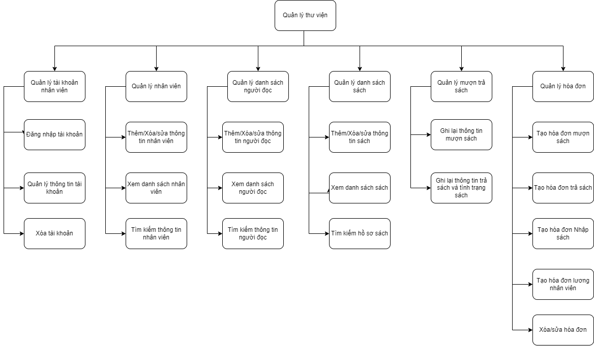
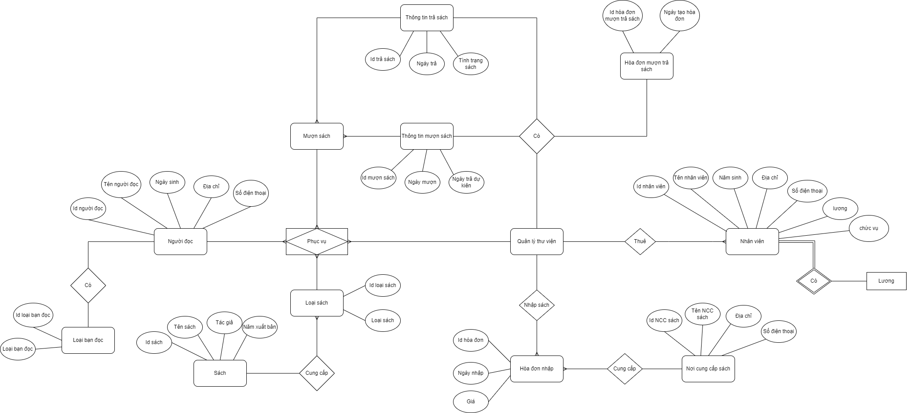
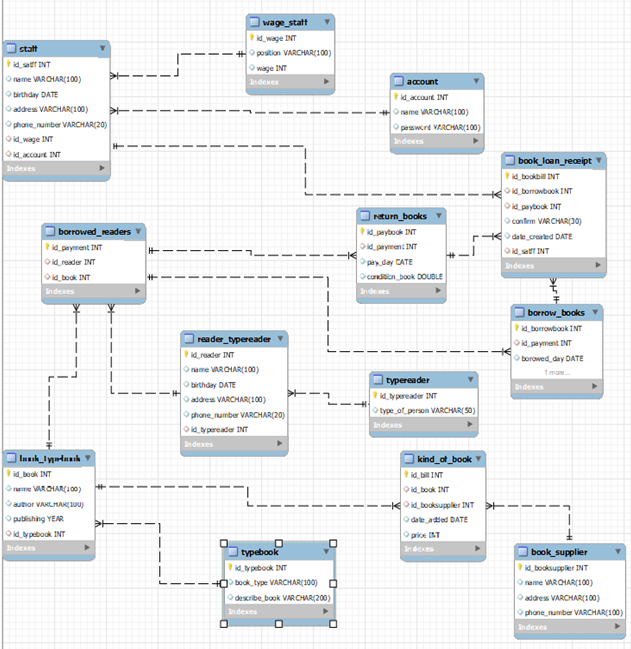

# Quản lý thư viện

## I.	Kịch bản thế giới thực
    
## 1.	Ứng dụng của hệ thống CSDL quản lý thư viện:
  Xây dựng hệ thống quản lý cơ sở dữ liệu phục vụ cho 1 thư viện của trường đại học:
    -	Quản lý danh sách tài khoản nhân viên
    -	Quản lý  danh sách nhân viên
    -	Quản lý danh sách người đọc
    -	Quản lý danh sách sách 
    -	Quản lý mượn trả sách
    -	Quản lý hóa đơn
## 2.	Yêu cầu dữ liệu cần lưu trữ
    -	Dữ liệu tài khoản
    -	Dữ liệu nhân viên
    -	Dữ liệu lương nhân viên
    -	Dữ liệu người đọc
    -	Dữ liệu loại người đọc
    -	Dữ liệu sách
    -	Dữ liệu loại sách
    -	Dữ liệu hóa đơn nhập sách
    -	Dữ liệu nơi cung cấp sách
    -	Dữ liệu mượn trả sách
    -	Dữ liệu thông tin mượn sách
    -	Dữ liệu thông tin trả sách
    -	Dữ liệu hóa đơn mượn trả sách
## 3.	Các thao tác trên cơ sở dữ liệu:
    -	Có thể thêm, xóa, sưa thông tin bạn đọc, sách đầu vào
    -	Có thể tra lịch sử người đọc đã mượn báo nhiêu sách, những sách gì
    -	Có thể sắp xếp người đọc theo số lượng sách đã mượn giảm dần
## 4.	Biểu đồ chức năng:

## 5. Sơ đồ luồng dữ liệu

## II. Lược đồ E-R
## 1. Mô tả lược đồ
    -	Một nhân viên chỉ có thể có duy nhất một tài khoản (1-1)
    -	Một chức vụ có thể có một nhân viên hoặc nhiều nhân viên (1-n)
    -	Một loại sách có thể có một sách hoặc nhiều sách(1-n)
    -	Một sách có thể có nhiều nơi cung cấp, nơi cung cấp cũng có thể có nhiều sách(n-n)
    -	Một người đọc có thể mượn một sách hoặc nhiều sách, sách cũng có thể có một hoặc nhiều người đọc mượn(n-n)
## 2. Lược đồ E-R

## 3. Ánh xạ lược đồ E-R
.png)

## 1. Tài khoản(id_account, name, password)
    id_account -> name
    id_account -> password
## 2. Nhân viên (id_satff, name, birthday, address, , id_wage, id_account)
    id_satff -> name
    id_satff -> birthday
    id_satff -> address
    id_satff -> phone_number
    id_satff -> id_wage
    id_satff -> id_account
## 3. Lương nhân viên (id_wage, position, wage)
    id_wage - > positon
    id_wage -> wage
## 4. Người đọc(id_reader, name, birthday, address, phone_number, id_wage)
    id_reader -> name
    id_reader -> birthday
    id_reader -> address
    id_reader -> phone_number
    id_reader -> id_wage
## 5. Loại người đọc(id_typereader, type_of_person)
    id_typereader -> type_of_person
## 6. Sách(id_book, name, author, publishing_year,  id_booktype)
    id_book -> name
    id_book -> author
    id_book -> publishing_year
    id_book -> id_booktype
## 7. Loại sách(id_booktype, book_type, describe)
    id_booktype -> book_type
    id_booktype -> describe
## 8. Hóa đơn nhập sách(id_bill, id_book, id_booksupplier, date_added, price)
    id_bill -> id_book
    id_bill -> id_booksupplier
    id_bill -> price
    id¬_bill -> date_added
## 9. Nơi cung cấp sách(id_booksupplier, name, address, phone_number)
    id_booksupplier -> name
    id_booksupplier -> address
    id_booksupplier -> phone_number
## 10. Mượn sách(id_payment, id_reader, id_book)
    id_payment -> id_reader
    id_payment -> id_book
## 11. Thông tin mượn sách(id_borrowbook, id_payment, borowed_day, expected_payment)
    id_borrowbook -> id_payment
    id_borrowbook -> borowed_day
    id_borrowbook -> expected_payment
## 12. Thông tin trả sách(id_paybook, id_payment, pay_day¸ condition)
    id_paybook -> id_payment
    id_paybook -> pay_day
    id_paybook -> condition
## 13. Hóa đơn mượn trả sách(id_bookbill, id_borrowbook, id_paybook, confirm, date_created, id_staff)
    id_bookbill -> id_borrowbook
    id_bookbill -> id_paybook
    id_bookbill -> confirm
    id_bookbill -> date_created
    id_bookbill -> id_staff

## III. diagram

